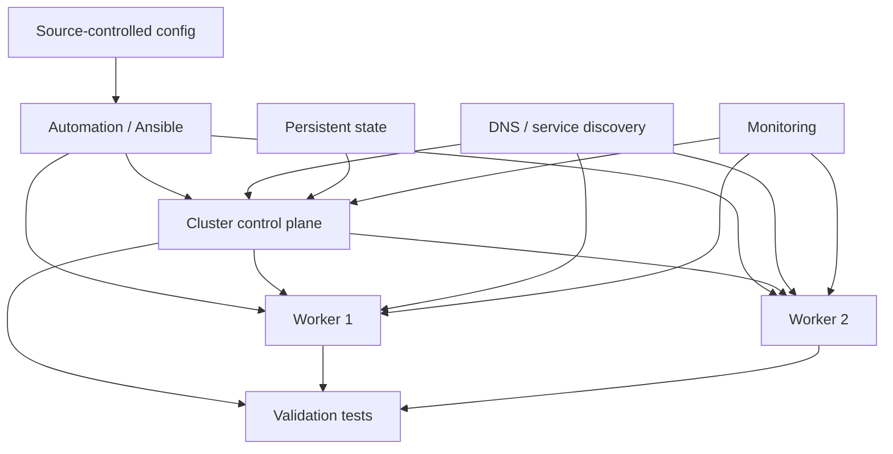

# Lazarus-Cluster

> **The cluster is going to die. Your job is to decide how much can fail, how fast it can recover, and whether you can bring the whole thing back from source-controlled truth.**

## Skills you will build

- Multi-node Linux infrastructure concepts
- Configuration management and infrastructure-as-code thinking
- Ansible and repeatable cluster provisioning
- Kubernetes and/or Slurm control-plane recovery concepts
- DNS, networking, storage, and service dependencies
- Backups, state, configuration, and recovery boundaries
- RTO/RPO and disaster-recovery reasoning
- Failure-domain design and chaos-style testing
- Incident response and recovery runbooks
- Rebuild validation, rollback, and postmortem writing

## General idea

Lazarus-Cluster is the **resilience and disaster-recovery lab**.

A fictional AI cluster called **Lazarus** has been built with one unusual acceptance requirement:

> It must prove that it can recover before anyone is allowed to depend on it.

Instead of waiting for failures, you will deliberately destroy pieces of the environment in increasingly severe scenarios: workers, services, DNS, scheduler components, configuration, monitoring, and eventually most or all of the cluster.

Each exercise asks three questions:

> **What survived? What recovered automatically? What did I have to rebuild—and why?**

The final goal is to make the environment reproducible enough that losing machines is an incident, not an archaeological expedition.

A laptop can host a lightweight version using Linux VMs, containers, or other virtual nodes. The point is control-plane and recovery behavior, not pretending the laptop is a production GPU fleet.

---

# The Lazarus Protocol

The fictional reliability team has issued a mandate:

> “Do not tell us the cluster is resilient. Kill it and show us.”

Every round removes something the environment was quietly depending on.

The first failures are obvious.
The later ones are not.

Eventually you should discover which pieces are truly replaceable, which contain state, which are single points of failure, and which “automated” builds still rely on undocumented human memory.

---

## Resurrection campaign

| Death | What is lost | Skill focus | Resurrection condition |
|---|---|---|---|
| 00 | **A Worker Falls** | node lifecycle | workload capacity returns predictably |
| 01 | **The Service Stops** | systemd/process recovery | identify restart vs root-cause behavior |
| 02 | **Names Go Dark** | DNS/service discovery | restore resolution without random changes |
| 03 | **The Network Splits** | routes/firewalls/connectivity | isolate and repair the failed path |
| 04 | **The Scheduler Loses a Limb** | K8s/Slurm components | recover scheduling capability |
| 05 | **Monitoring Goes Blind** | observability dependencies | restore visibility and identify detection gaps |
| 06 | **Configuration Rot** | drift, Ansible, idempotency | return nodes to declared state |
| 07 | **The State Question** | persistent data/config | distinguish disposable from irreplaceable state |
| 08 | **Two Failures at Once** | correlated failure | recover while avoiding false root causes |
| 09 | **The Empty Host** | bare rebuild | reconstruct a node from automation and docs |
| 10 | **The Cluster Is Gone** | full environment rebuild | rebuild core services from known-good sources |
| FINAL | **Lazarus Event** | blind multi-fault disaster | meet defined recovery objectives and publish the RCA |

---

## What counts as resurrection?

A green ping is not enough.

For each scenario define recovery checks such as:

```text
node reachable
required services healthy
DNS correct
scheduler sees expected resources
workload can be submitted
storage/state available
monitoring sees the node
alerts cleared for the right reason
configuration matches desired state
```

The recovery is complete only when the **system's intended function** is restored.

---

## Recovery architecture



The project should gradually identify which arrows represent dependencies, which are rebuild paths, and which are dangerous single points of failure.

---

## The death card system

Once the environment is stable, create failure cards and choose one without reading the repair instructions.

Examples:

### Death Card: The Missing Route
One node can reach its local peers but not the control plane.

### Death Card: The Stale Configuration
Automation says a node is correct, but a manual change has left it inconsistent.

### Death Card: The Silent DNS Failure
IP connectivity works. Names do not. Several downstream services fail in misleading ways.

### Death Card: The Scheduler Is Healthy—Except It Isn't
The service is running, but jobs remain pending because an underlying dependency is wrong.

### Death Card: Restore From Nothing
Delete a disposable virtual node completely and recreate it from documentation plus source-controlled configuration.

The interesting failures are ones whose **symptoms appear at a different layer than the root cause**.

---

## Recovery metrics

Introduce real reliability language:

- **RTO** — how long can this function remain unavailable?
- **RPO** — how much state/data can be lost?
- detection time
- diagnosis time
- repair time
- validation time
- manual steps required
- undocumented dependencies discovered

Track these honestly during later exercises.

The goal is not impressive numbers on a laptop. It is learning what has to be measured before terms like “recoverable” mean anything.

---

## The Lazarus ledger

Each resurrection should leave a record:

```text
Scenario:
Failure injected:
User-visible symptom:
Expected dependency path:
Detection method:
Initial hypotheses:
Root cause:
State lost:
Automated recovery:
Manual recovery:
Validation:
Time to restore:
What should be automated next:
What documentation was missing:
What design change would reduce recurrence:
```

The lab gets stronger every time a failure exposes an assumption.

---

## Suggested repository structure

```text
Lazarus-Cluster/
├── README.md
├── architecture/
├── provisioning/
├── ansible/
├── recovery-tests/
├── death-cards/
├── runbooks/
├── incidents/
├── validation/
└── evidence/
```

---

## Completion standard

Lazarus-Cluster is complete when you can erase a meaningful portion of the lab and recover it from:

- source-controlled configuration,
- automation,
- documented state/backups,
- and a validation procedure.

You should also be able to explain **what cannot be recreated** and why.

The capstone is a full Lazarus Event: an unknown combination of failures followed by recovery and a postmortem.

> **A resilient cluster is not one that never dies. It is one whose death is understood, bounded, and recoverable.**
